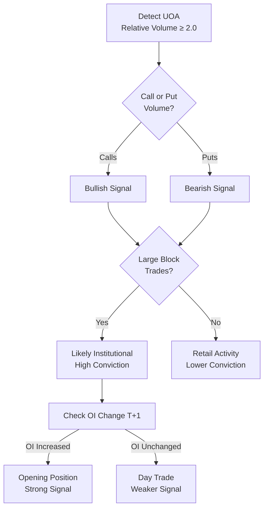
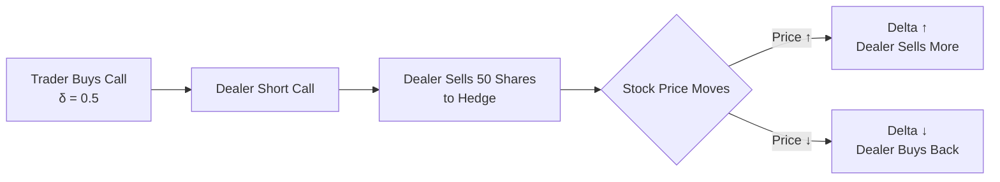
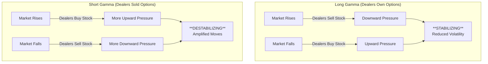
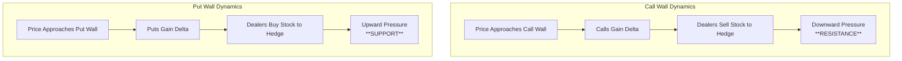
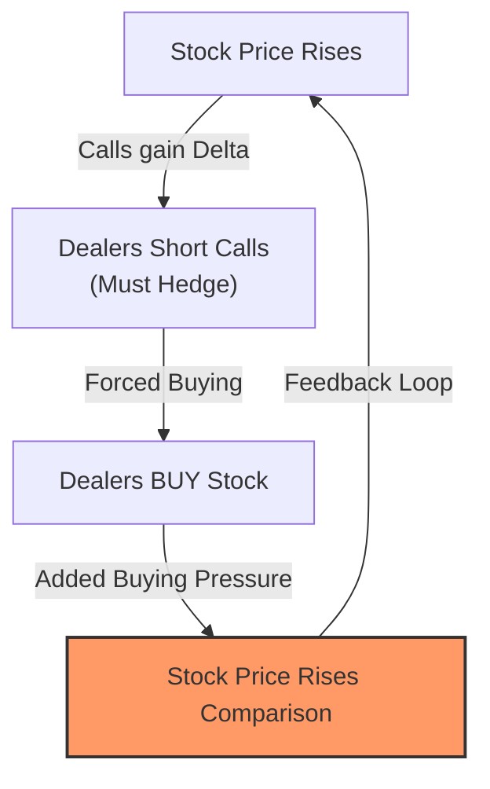
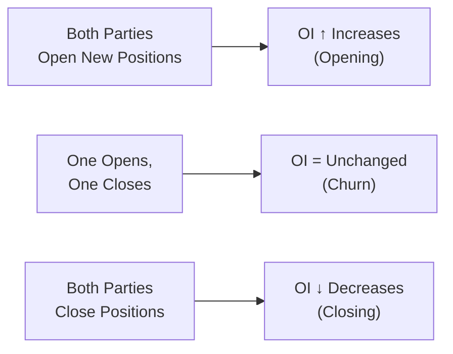

# OptionData Product Concepts

> **Data Reference**: [Data Structure](./data_structure.md)  
> **Last Updated**: 2026-01-20

This document summarizes key concepts from the OptionData product documentation for internal reference. It is organized into foundational concepts, core Greeks & metrics, market structure indicators, and real-time flow analysis. **Field names referenced here (e.g., `side`, `sentiment`, `dex`) correspond to the actual data fields documented in [Data Structure](./data_structure.md).**

---

## Table of Contents
1. [Quick Reference Tables](#quick-reference-tables)
   - [Trade Execution Side](#trade-execution-side-side-field)
   - [Buy vs Sell: Inferring Trade Direction](#buy-vs-sell-inferring-trade-direction)
   - [Sentiment Derivation](#sentiment-derivation-sentiment-field)
   - [Trade Activity Types](#trade-activity-types-option_activity_type-field)
   - [Moneyness Classification](#moneyness-classification-moneyness-field)
2. [Foundational Concepts](#foundational-concepts)
   - [Data-Driven Trading Strategy](#data-driven-trading-strategy)
   - [Understanding Option Quotes](#understanding-option-quotes)
   - [Options Dictionary](#options-dictionary)
3. [Core Greeks & Metrics](#core-greeks--metrics)

   - [Delta Exposure (DEX)](#delta-exposure-dex)
   - [Delta Impact (DEI)](#delta-impact-dei)
   - [Gamma Exposure (GEX)](#gamma-exposure-gex)
     - [Call Wall vs Put Wall](#call-wall-vs-put-wall)
     - [Gamma Squeeze](#gamma-squeeze)
     - [The 0DTE Phenomenon](#the-0dte-phenomenon)
   - [Implied Volatility (IV)](#implied-volatility-iv)
4. [Option Chain Analysis](#option-chain-analysis)
   - [Option Chain vs Option Flow](#option-chain-vs-option-flow)
   - [Open Interest (OI)](#open-interest-oi)
   - [Analyzing OI Changes & Trade Intent](#analyzing-oi-changes--trade-intent)

---

## Quick Reference Tables

### Trade Execution Side (`side` field)

The `side` field indicates where the trade was executed relative to the bid-ask spread:

| Side Value | Description | Interpretation |
|------------|-------------|----------------|
| **AASK** | Above Ask | Very aggressive buyer - strong conviction |
| **ASK** | At Ask | Aggressive buyer - willing to pay the offer |
| **MID** | Between Bid/Ask | Neutral execution - could be either party |
| **BID** | At Bid | Aggressive seller - hitting the bid |
| **BBID** | Below Bid | Very aggressive seller - desperate to exit |

> [!TIP]
> **Side classification logic**:
> ```
> AASK  = price > ask           (Above Ask)
> ASK   = price >= ask          (At Ask)
> MID   = price between bid/ask (Mid)
> BID   = price <= bid          (At Bid)
> BBID  = price < bid           (Below Bid)
> ```

### Buy vs Sell: Inferring Trade Direction

In options flow data, we don't have a direct "buy" or "sell" flag. Instead, we **infer the likely aggressor** (buyer or seller) based on where the trade executed relative to the bid-ask spread.

#### The Bid-Ask Spread Concept

```
         BID                              ASK
          │                                │
          ▼                                ▼
    ┌─────────────────────────────────────────┐
    │  Sellers willing    │   Buyers willing  │
    │  to sell at BID     │   to buy at ASK   │
    └─────────────────────────────────────────┘
                          │
                         MID
```

- **BID price**: The highest price a buyer is willing to pay
- **ASK price**: The lowest price a seller is willing to accept
- **Spread**: The difference between ASK and BID

#### Who is the Aggressor?

| Trade Executes At | Likely Aggressor | Why? |
|-------------------|------------------|------|
| **ASK or above** | **BUYER** | Buyer is "crossing the spread" — paying the seller's asking price to get filled immediately |
| **BID or below** | **SELLER** | Seller is "hitting the bid" — accepting the buyer's bid price to exit immediately |
| **MID** | **Unknown** | Could be negotiated trade, spread trade, or market maker activity |

> [!IMPORTANT]
> **Key insight**: The aggressor pays a premium for immediacy.
> - A buyer paying ASK wants to get in NOW (urgency = conviction)
> - A seller hitting BID wants to get out NOW (urgency = conviction or desperation)

#### Connecting to Sentiment

Once we know the likely aggressor (buyer vs seller) and the option type (CALL vs PUT), we can infer sentiment:

| Option Type | Aggressor | Action | Market View |
|-------------|-----------|--------|-------------|
| CALL | Buyer (at ASK) | Opening long call or closing short call | **Bullish** |
| CALL | Seller (at BID) | Opening short call or closing long call | **Bearish** |
| PUT | Buyer (at ASK) | Opening long put or closing short put | **Bearish** |
| PUT | Seller (at BID) | Opening short put or closing long put | **Bullish** |

### Sentiment Derivation (`sentiment` field)

The `sentiment` field is derived from the combination of `put_call` and `side`:

| `put_call` | `side` | `sentiment` | Interpretation |
|------------|--------|-------------|----------------|
| CALL | AASK/ASK | **BULLISH** | Buyer paying up for calls = expects upside |
| CALL | BID/BBID | **BEARISH** | Seller dumping calls = closing or hedging |
| PUT | AASK/ASK | **BEARISH** | Buyer paying up for puts = expects downside |
| PUT | BID/BBID | **BULLISH** | Seller closing puts = less concerned about downside |
| Any | MID | **NEUTRAL** | Indeterminate - could be either party |

### Trade Activity Types (`option_activity_type` field)

#### Quick Reference Codes

| Code | Full Name | Description |
|------|-----------|-------------|
| **AUTO** | Auto Execution | Standard electronic matching |
| **SLAN** | Stock-Option AIM | Intermarket sweep linked order |
| **MLET** | Multi-Leg Electronic | Multi-leg strategy execution |
| **SLAI** | AIM Stock/Option | AIM-linked stock/option order |
| **MAIM** | Multi-Leg AIM | Complex multi-leg AIM execution |
| **MLAI** | Multi-Leg AIM Interactive | Interactive multi-leg via AIM |
| **MLAT** | Multi-Leg Auto Trade | Automated multi-leg execution |
| **SHOT** | Stock-Option Order | Stock + option combo order |
| **ISOI** | ISO Intermarket | Intermarket price protection |

> [!NOTE]
> These codes come from the exchange and indicate the execution mechanism. For most analysis purposes, you can focus on trade size, premium, and sentiment rather than activity type.

#### Trade Condition Codes

| Condition | Description |
|-----------|-------------|
| **Regular** | Transaction was a regular sale without stated conditions |
| **AutoExecution** | Transaction was executed electronically; Processed like a regular trade |
| **IntermarketSweep** | Transaction was the execution of an order identified as an Intermarket Sweep Order |
| **StockContingent** | Transaction represents multi-leg option/stock trade |
| **MultiLeg** | Transaction represents a leg of a multi-leg option trade |
| **MultiLegProprietaryProduct** | Transaction represents execution of a proprietary product such as index options non-electronic. The trade price may be outside the current NBBO |

#### Detailed Trade Descriptions

| Trade Type | Description |
|------------|-------------|
| **Single Leg Auction Non ISO** | Execution of an electronic order "stopped" at a price and traded in a two-sided auction mechanism through an exposure period (Price Improvement, Facilitation, or Solicitation) |
| **Single Leg Auction ISO** | Execution of an Intermarket Sweep electronic order "stopped" at a price and traded in a two-sided auction mechanism through an exposure period, marked as ISO |
| **Single Leg Cross Non ISO** | Execution of an electronic order "stopped" at a price and traded in a two-sided crossing mechanism without exposure period (Customer to Customer Cross, QCC with single option leg) |
| **Single Leg Cross ISO** | Execution of an Intermarket Sweep electronic order "stopped" at a price and traded in a two-sided crossing mechanism without exposure period |
| **Single Leg Floor Trade** | Non-electronic trade executed on a trading floor, including Paired and Non-Paired Auctions and Cross orders |
| **Multi Leg autoelectronic trade** | Electronic execution of a multi-leg order traded in a complex order book |
| **Multi Leg Auction** | Execution of an electronic multi-leg order "stopped" at a price and traded in a two-sided auction mechanism through an exposure period in a complex order book |
| **Multi Leg Cross** | Execution of an electronic multi-leg order "stopped" at a price and traded in a two-sided crossing mechanism without exposure period (Customer to Customer Cross, QCC with 2+ options legs) |
| **Multi Leg floor trade** | Non-electronic multi-leg order trade executed on a trading floor against other multi-leg orders, including Paired and Non-Paired Auctions |
| **Multi Leg autoelectronic trade against single leg(s)** | Electronic execution of a multi-leg order traded against single leg orders/quotes |
| **Stock Options Auction** | Execution of an electronic multi-leg stock/options order "stopped" at a price and traded in a two-sided auction mechanism through an exposure period |
| **Multi Leg Auction against single leg(s)** | Execution of an electronic multi-leg order "stopped" at a price and traded in a two-sided auction mechanism through an exposure period against single leg orders/quotes |
| **Multi Leg floor trade against single leg(s)** | Non-electronic multi-leg order trade executed on a trading floor against single leg orders/quotes, including Paired and Non-Paired Auctions |
| **Stock Options autoelectronic trade** | Electronic execution of a multi-leg stock/options order traded in a complex order book |
| **Stock Options Cross** | Execution of an electronic multi-leg stock/options order "stopped" at a price and traded in a two-sided crossing mechanism without exposure period |
| **Stock Options floor trade** | Non-electronic multi-leg stock/options trade executed on a trading floor in a complex order book, including Paired and Non-Paired Auctions and Cross orders |
| **Stock Options autoelectronic trade against single leg(s)** | Electronic execution of a multi-leg stock/options order traded against single leg orders/quotes |
| **Stock Options Auction against single leg(s)** | Execution of an electronic multi-leg stock/options order "stopped" at a price and traded in a two-sided auction mechanism through an exposure period against single leg orders/quotes |
| **Stock Options floor trade against single leg(s)** | Non-electronic multi-leg stock/options order trade executed on a trading floor against single leg orders/quotes, including Paired and Non-Paired Auctions |
| **Multi Leg Floor Trade of Proprietary Products** | Execution of a proprietary product non-electronic multi-leg order with at least 3 legs. The trade price may be outside the current NBBO |
| **Multilateral Compression Trade of Proprietary Products** | Execution in a proprietary product done as part of a multilateral compression. Trades are executed outside regular trading hours at prices derived from end-of-day markets. Does not update Open, High, Low, and Closing Prices |
| **Extended Hours Trade** | Trade executed outside of regular market hours. Does not update Open, High, Low, and Closing Prices |

### Moneyness Classification (`moneyness` field)

| Value | Description | Typical Usage |
|-------|-------------|---------------|
| **ITM** | In The Money | Strike favorable vs current price |
| **ATM** | At The Money | Strike ≈ current price |
| **OTM** | Out of The Money | Strike unfavorable vs current price |

---

## Foundational Concepts

### Data-Driven Trading Strategy

**Definition**: An approach to investment using data and analytics to make informed trading decisions based on objective information rather than subjective chart interpretations.

**Key Advantages**:
- Uses historical data, current market conditions, and company performance
- Identifies patterns and trends not immediately apparent through technical analysis
- More reliable than technical analysis alone (less influenced by personal biases)

**OptionData Application**: The Smart Option Flow identifies trading opportunities when option prices deviate significantly from expected values due to unusual trading activity, providing insights into market sentiment.

### Understanding Option Quotes

An option **quote** is not a single price, but a two-way price structure known as the **NBBO** (National Best Bid and Offer) that represents the market's current willingness to trade.

#### Components of a Quote

| Component | Definition | Represents |
|-----------|------------|------------|
| **Bid Price** | The highest price a buyer is publicly offering. | Market's "floor" (Sell Price) |
| **Ask Price** | The lowest price a seller is publicly accepting. | Market's "ceiling" (Buy Price) |
| **Bid Size** | Number of contracts buyers want at the Bid Price. | Demand liquidity |
| **Ask Size** | Number of contracts sellers offer at the Ask Price. | Supply liquidity |
| **Spread** | Difference between Ask and Bid (`Ask - Bid`). | Cost of liquidity |

> [!NOTE]
> **Example Quote**: `Bid: $2.50 x 50` | `Ask: $2.55 x 100`
> - **Sell immediately** at **$2.50** (hit the bid).
> - **Buy immediately** at **$2.55** (take the ask).
> - **Liquidity**: Market is deeper on the sell side (100 contracts) than the buy side (50 contracts).

#### Why Quotes Matter
1. **Liquidity & Slippage**: A tight spread (e.g., $0.05) indicates high liquidity. A wide spread (e.g., $0.50 on a $2.00 option) implies low liquidity, meaning you lose more value just by entering/exiting the trade.
2. **Trade Inference**: As explained in the [Buy vs Sell](#buy-vs-sell-inferring-trade-direction) section, we use the Bid/Ask prices to infer whether a trade was initiated by a buyer (Ask side) or seller (Bid side).

---


### Options Dictionary

#### Core Data Fields
| Term | Data Field | Definition |
|------|------------|------------|
| **Put/Call** | `put_call` | Option type: `CALL` (right to buy) or `PUT` (right to sell) |
| **Strike** | `strike` | Price at which the option can be exercised |
| **Expiration** | `expiration_date` | Date when the option contract expires |
| **Days to Expiration** | `expiry_days` | Number of days until expiration (DTE) |
| **Size** | `size` | Number of contracts traded |
| **Premium** | `premium` | Total dollar value of trade (`price × size × 100`) |
| **Underlying Price** | `underlying_price` | Stock price at trade execution |

#### Derived Metrics
| Term | Data Field | Definition |
|------|------------|------------|
| **Moneyness** | `moneyness` | Relationship between strike and underlying: `ITM`, `ATM`, `OTM` |
| **Side** | `side` | Trade execution location: `AASK`, `ASK`, `MID`, `BID`, `BBID` |
| **Sentiment** | `sentiment` | Inferred outlook: `BULLISH`, `BEARISH`, `NEUTRAL` |
| **Delta Exposure (DEX)** | `dex` | Directional exposure = `delta × size` |
| **Delta Impact (DEI)** | `dei` | Flow relative to liquidity = `dex ÷ avg_daily_volume` |

#### Greeks (Recalculated)
| Term | Data Field | Definition |
|------|------------|------------|
| **Delta** | `delta` | Option price sensitivity to $1 stock move (-1 to +1) |
| **Gamma** | `gamma` | Rate of delta change as stock price moves |
| **Implied Volatility (IV)** | `iv` | Market's expectation of future price volatility |
| **Theta** | `theta` | Time decay - premium erosion per day |
| **Vega** | `vega` | Sensitivity to IV changes |
| **Rho** | `rho` | Interest rate sensitivity (rarely used) |

> [!NOTE]
> Greeks are **recalculated locally** using Black-Scholes with a 5% risk-free rate for more accurate values.

#### Market Concepts
| Term | Definition |
|------|------------|
| **Open Interest (OI)** | Number of active (unsettled) contracts (`oi` field) |
| **UOA** | Unusual Options Activity — abnormally large trades |
| **Gamma Exposure (GEX)** | Total gamma-driven hedging pressure from dealers |
| **Gamma Squeeze** | Sharp price increase from dealers forced to buy stock as call delta increases |
| **IV Crush** | Sharp IV decline after anticipated events as uncertainty resolves |

---

### Aggregation Mode

#### Concept
Real-time Option Trades in **AGGREGATED** mode consolidates trades with the same option symbol executed simultaneously (at the second level) into a single aggregate trade. This approach simplifies the identification of large trades that have been divided into multiple smaller transactions.

**RAW** mode shows the original trades without any modification.

#### Key Differences

| Feature | RAW Mode | AGGREGATED Mode |
|---------|----------|-----------------|
| **Trade Count** | Always 1 | 1 or greater (indicates aggregation) |
| **Daily Volume** | ~7 million rows | ~4 million rows |
| **Purpose** | Precise, unmodified data | Identifying block trades & hidden liquidity |

#### When to Use?

- **AGGREGATED Mode (Default)**: In most cases, **AGGREGATED Mode** is sufficient. It allows you to identify significant block trades where institutional players may have divided large trades into smaller ones.
- **RAW Mode**: Use this mode if you specifically want to explore the **unmodified, original data flow** without any consolidation.

#### Aggregation Logic Example

**Scenario**: Two trades for TSLA $330 Call executed at the exact same second.

**1. RAW Data Input**
```text
date        time      symbol  strike  put_call expiration_date premium size trade_count
2025-02-01  09:32:02  TSLA    330     CALL     2025-02-15       1000    2    1
2025-02-01  09:32:02  TSLA    330     CALL     2025-02-15       2000    3    1
```

**2. AGGREGATED Output**
```text
date        time      symbol  strike  put_call expiration_date premium size trade_count
2025-02-01  09:32:02  TSLA    330     CALL     2025-02-15       3000    5    2
```

**Calculation**:
- **Size**: Sum of sizes (2 + 3 = 5)
- **Premium**: Sum of premiums (1000 + 2000 = 3000)
- **Trade Count**: Sum of counts (1 + 1 = 2)
- **Other Fields** (e.g., Delta, IV): Average of the original values.

---

### Unusual Options Activity (UOA)

#### What Is UOA?

**Unusual Options Activity (UOA)** refers to an abnormal surge in the volume of options contracts traded for a specific stock, compared to its average daily options volume. When options volume spikes well beyond the norm, it can indicate heightened investor interest and potential major price movements or events on the horizon.

> [!IMPORTANT]
> An unexpected jump in call or put options on a particular stock may signal institutional activity, upcoming catalysts, or significant shifts in market sentiment.

#### Why Is UOA Important?

Unusual options activity provides valuable insights for traders:

| Benefit | Description |
|---------|-------------|
| **Spot Trading Opportunities** | Significant deviation in option volume can create situations where options may be temporarily overvalued or undervalued, allowing traders to capitalize on these fluctuations |
| **Gauge Market Sentiment** | Combining options volume analysis with stock price movements and implied volatility helps understand market outlook. High call volume suggests growing confidence; spike in puts implies caution or pessimism |
| **Identify Institutional Activity** | Large block trades often indicate moves by sophisticated investors, providing valuable clues for retail traders |

#### Measuring UOA: Relative Volume

**Relative Volume** compares the current day's options trading activity to the stock's average daily options volume.

```
Relative Volume = Current Day's Options Volume ÷ Average Daily Options Volume
```

| Relative Volume | Interpretation |
|----------------|----------------|
| **2.0** | Double the typical trading activity |
| **3.0+** | Highly unusual activity |
| **5.0+** | Extremely unusual activity - major event likely |

> [!TIP]
> Focus on stocks with relative volume ≥ 2.0 to filter out normal market noise and identify truly unusual activity.

#### Options Volume vs. Number of Trades

It's critical to distinguish between these two metrics:

| Metric | Definition | Significance |
|--------|------------|--------------|
| **Options Volume** | Total contracts traded | Shows overall activity magnitude |
| **Number of Trades** | Count of individual transactions | Reveals whether volume came from few large trades or many small ones |

**Why This Matters**:
- **Single Large Trade (Block Trade)**: Often indicates institutional activity, as large investors make substantial moves in one transaction
- **Many Small Trades**: Could be retail activity or market maker hedging, generally less directional signal

#### UOA Analysis Strategy

When analyzing unusual options activity, consider:

1. **Volume Breakdown**: Are calls or puts driving the volume?
   - High call volume = Bullish sentiment
   - High put volume = Bearish sentiment

2. **Trade Size Distribution**: 
   - Large block trades = Institutional positioning
   - Scattered small trades = Less significant

3. **Combined Analysis**:
   - UOA + Stock price movement
   - UOA + Implied volatility changes
   - UOA + Open Interest changes (T+1 confirmation)

> [!NOTE]
> **Block Trade Threshold**: Trades significantly larger than average trade size for that stock. Often indicates "smart money" positioning.

#### From UOA to Actionable Insights



---

## Core Greeks & Metrics

### Delta Exposure (DEX)

#### Definition
**Delta**: Measures how much an option's price moves when the underlying stock moves $1.
- Call options: Delta ranges from **0 to 1**
- Put options: Delta ranges from **-1 to 0**

**Delta Exposure**: Translates option positions into equivalent shares.
- +500 delta exposure ≈ owning 500 shares
- -500 delta exposure ≈ shorting 500 shares

#### Formula (as stored in `dex` field)
```
dex = delta × size
```

> [!IMPORTANT]
> Note: The stored `dex` field uses `delta × size`, not `delta × size × 100`. This represents delta-equivalent contracts, not shares.

#### Example
- Buy 10 AAPL calls at δ=0.60 → **+600 delta exposure**
- Sell 5 AAPL calls at δ=0.20 → **-100 delta exposure**
- **Net**: +500 delta (behaves like owning 500 shares)

#### Delta Trade Direction Reference

| Trade Type | Direction | Delta Effect |
|------------|-----------|--------------|
| Buying a Call | Bullish | **Positive** Delta |
| Selling a Put | Bullish | **Positive** Delta |
| Buying a Call Spread | Bullish | **Positive** Delta |
| Selling a Credit Put Spread | Bullish | **Positive** Delta |
| Selling a Call | Bearish | **Negative** Delta |
| Buying a Put | Bearish | **Negative** Delta |
| Selling a Call Spread | Bearish | **Negative** Delta |
| Buying a Put Spread | Bearish | **Negative** Delta |

#### Dealer Hedging Behavior
When a trader buys an ATM call with δ=0.5, the dealer sells 50 shares to stay delta-neutral. As stock price moves, delta changes, requiring the dealer to adjust their hedge.



#### Why DEX > Premium or Notional Value

| Metric | Limitation | DEX Advantage |
|--------|------------|---------------|
| **Premium** | Affected by time decay, IV, interest rates, intrinsic value | **Cuts through noise** to reveal true directional intent |
| **Notional Value** | Shows cost, not impact | Shows how much a trade actually moves with the stock |

---

### Delta Impact (DEI)

#### Definition
Measures how significant an option trade's directional exposure is **relative to the average daily trading volume** of the underlying.

#### Formula (as stored in `dei` field)
```
dei = dex ÷ avg_daily_volume
```

> [!NOTE]
> The `dei` field represents the ratio of delta exposure to average daily volume, indicating the relative significance of a trade.

#### Interpretation

| DEI Value | Significance | Market Impact |
|-----------|--------------|---------------|
| **≥20%** | Very High | Trade is large enough to **impact stock price** |
| **5-20%** | Moderate | Notable positioning; worth monitoring |
| **<1%** | Low | Trade is small, unlikely to move market |

> [!IMPORTANT]
> DEI surges often signal: institutional positioning, pre-hedging for catalysts (earnings), or anticipated volatility.

#### Case Study: BP Prudhoe Bay Royalty Trust ($BPT)
- **Date**: June 13, 2023
- **DEI**: 83.31% (extremely high)
- **Outcome**: Stock surged **6%** on June 16th, up to **11% intraday**
- **Takeaway**: Unusually high DEI preceded significant directional move

---

### Gamma Exposure (GEX)

#### Definition
**Gamma**: Measures how much delta changes when the underlying stock moves.
- Delta = how much option price changes when stock moves
- **Gamma = how much delta changes as stock moves** (the "acceleration" of delta)

**Gamma Exposure**: Total gamma of options positions; determines dealer hedging behavior.



#### Gamma Environment Comparison

| Aspect | Long Gamma (Stabilizing) | Short Gamma (Destabilizing) |
|--------|--------------------------|----------------------------|
| **Dealer Behavior** | Counter-cyclical | Pro-cyclical |
| **Price Action** | Range-bound, choppy | Trending, volatile |
| **Breakout Risk** | Significant breakouts **less likely** | Prone to directional moves |
| **Volatility** | Suppressed ("gamma pinning") | Elevated spike risk |
| **Favorable Strategies** | Income-generating (covered calls, CSPs) | Momentum/trend-following |

#### OptionData GEX Metrics
| Metric | Description |
|--------|-------------|
| **Call GEX** | Total gamma from call options |
| **Put GEX** | Total gamma from put options |
| **Net GEX** | Combined gamma exposure |
| **P/C GEX Ratio** | Call vs put gamma dominance |

#### Call Wall vs Put Wall

These are critical GEX levels where dealers have significant gamma exposure.

##### Definitions
| Wall Type | Definition | Technical Effect |
|-----------|------------|------------------|
| **Call Wall** | Strike with the highest call open interest (and usually GEX) | Acts as **resistance** |
| **Put Wall** | Strike with the highest put open interest (and usually GEX) | Acts as **support** |

##### Dealer Hedging Mechanism



##### Comparison Table

| Aspect | Call Wall | Put Wall |
|--------|-----------|----------|
| **Direction** | Resistance (hinders price rise) | Support (prevents price drop) |
| **Hedging** | Dealers sell stock near wall | Dealers buy stock near wall |
| **Option Type** | Right to buy at strike | Right to sell at strike |
| **Price Magnet Effect** | Pulls price down toward strike | Pulls price up toward strike |

> [!NOTE]
> These are **probabilistic indicators**, not guarantees. Other factors (technicals, sentiment, fundamentals) also influence price.


#### Gamma Squeeze

A **Gamma Squeeze** is a feedback loop that forces dealers to buy stock aggressively as prices rise, causing an explosive upward move.

##### The Mechanism (Short Gamma)
1.  **Setup**: Dealers are **Short Gamma** (they sold many OTM calls to retail/institutions).
2.  **Trigger**: Stock price starts to rise (e.g., due to news or momentum).
3.  **Delta Expansion**: As price rises, the delta of those short calls increases (approaches 1.0).
4.  **Forced Buying**: To stay delta-neutral, dealers **MUST buy the underlying stock**.
5.  **Loop**: Dealer buying pushes stock price higher $\to$ Deltas increase further $\to$ Dealers buy more.



> [!IMPORTANT]
> **Key Warning Sign**: High **Call GEX** combined with a rising stock price can trigger this loop. The "squeeze" ends when dealers finish hedging or the options expire/are closed.


#### The 0DTE Phenomenon

**Definition**: **0DTE** (Zero Days to Expiration) options are contracts that expire at the close of the current trading day.

**Significance**:
- **Volume Dominance**: 0DTEs often account for >40% of daily volume in major indices (SPX, SPY).
- **Extreme Gamma**: As expiration nears, Gamma explodes, creating rapid price acceleration potential.

##### Market Impact: Stabilizing vs. Destabilizing

0DTE flows impact market volatility depending on dealer positioning:

| Scenario | Market Effect | Why? |
|----------|---------------|------|
| **Traders High Volume Selling** (Yield Harvesting) | **Stabilizing** | Dealers are LONG Gamma $\to$ Buy dips / Sell rips (suppresses volatility). |
| **Traders High Volume Buying** (Speculation) | **Destabilizing** | Dealers are SHORT Gamma $\to$ Chase price (accelerates volatility). |

##### Analyzing 0DTE Flow
Since OI effectively resets daily, traditional **Open Interest analysis is irrelevant** for 0DTE. Instead, focus on:
- **Intraday Volume**: Real-time surges indicate immediate positioning.
- **Vanna/Charm**: Second-order Greeks that decay rapidly as the closing bell approaches.

---

### Implied Volatility (IV)

#### Definition
Market's expectation of future volatility in the underlying asset's price, derived from the option's market price.

#### Key Factors
1. **Market Sentiment**: Earnings, economic data, geopolitical events
2. **Time to Expiration**: Longer expiration → higher IV
3. **Underlying Asset**: Tech stocks/commodities → higher IV than blue-chips

#### IV Environment Trading Guide

| Aspect | Low IV Environment | High IV Environment |
|--------|-------------------|---------------------|
| **Market Outlook** | Stable prices expected | Larger price swings expected |
| **Investor Sentiment** | Optimistic/neutral | Cautious/uncertain |
| **Risk Level** | Lower risk, calmer | Higher risk, volatile |
| **Option Pricing** | Affordable premiums | Premium pricing due to uncertainty |
| **Best Strategies** | Income-based, range-bound (covered calls, spreads) | Volatility plays (straddles, strangles), selling rich premiums |

#### Volatility Patterns

**Volatility Smile**: IV curve that rises at both ends when plotted against strike prices (OTM puts and calls have higher IV than ATM).

**Causes**:
- Crash risk (OTM puts for downside protection)
- Speculation (OTM calls for upside)
- Fat-tailed distributions (extreme moves more common than models assume)

**Volatility Skew**: Asymmetric IV pattern common in equity markets where puts have higher IV than calls (investors fear crashes more than rallies).

**IV Crush**: Sharp IV decline after anticipated events (earnings, major news) as uncertainty is resolved.

> [!TIP]
> **Pre-earnings play**: Consider selling premium before earnings to capture IV crush, but be aware of gap risk.

#### OI + IV Combined Analysis

| Pattern | OI Change | IV Change | Interpretation | Typical Action |
|---------|:---------:|:---------:|----------------|----------------|
| Long Buildup | ↑ | ↑ | Adding bullish positions | Accumulation phase |
| Long Liquidation | ↓ | ↓ | Closing bullish positions | Profit-taking |
| Short Buildup | ↑ | ↓ | Adding bearish positions | Distribution phase |
| Short Covering | ↓ | ↑ | Exiting short positions | Squeeze potential |

---

## Option Chain Analysis

### Option Chain vs Option Flow

Understanding the difference between these two data views is crucial for analysis.

| Feature | Option Chain ("The Map") | Option Flow ("The Stream") |
|---------|--------------------------|----------------------------|
| **Definition** | Static snapshot of market status (OI, Volume, Bid/Ask) for all strikes | Real-time stream of individual trade executions (Time & Sales) |
| **Timeframe** | Cumulative (Today's state) | Instantaneous (Right now) |
| **Questions Answered** | "How is the market positioned?" / "Where are the walls?" | "What are traders doing *right now*?" / "Is there urgency?" |
| **Key Metric** | **Open Interest (OI)** | **Premium & Aggression** |
| **Analogy** | A topographic map (terrain) | A live video feed of traffic |

#### The Relationship
1.  **Flow creates the Chain**: Today's flow activity eventually settles into tomorrow's Open Interest (if trades are opening and held).
2.  **Chain Contextualizes Flow**: A \$1M call sweep is more significant if it breaks through a major "Call Wall" (Chain level) than if it happens in a vacuum.
3.  **Analysis Loop**:
    - Watch **Flow** for immediate moves.
    - Check **Chain** to see if the move has room to run (no resistance).
    - Checks **OI** next day (T+1) to confirm if the Flow stuck.

---

### Open Interest (OI)

#### Definition
Total number of active option contracts that are outstanding (not yet closed, exercised, or expired).

#### OI vs Volume

| Metric | Description | Reset |
|--------|-------------|-------|
| **Volume** | Contracts traded in a single day | Daily |
| **Open Interest** | Total open contracts across all days | Cumulative |

#### OI Update Frequency

> [!WARNING]
> **OI is NOT Real-Time**
> Open Interest is calculated by the OCC (Options Clearing Corporation) **overnight** and updated once per day before market open (approx. 6:30 AM ET).
> - The OI you see during the trading day represents the **previous day's closing OI**.
> - Intraday trades (Volume) do **not** update OI until the next morning.

#### Analyzing OI Changes & Trade Intent

Since OI is lagging, we look at the **change in OI** from one day to the next to determine if a large trade was "opening" (new positioning) or "closing" (liquidation).

**Calculation**:
```
ΔOI = Today's OI - Yesterday's OI
```

| Relationship (Approx.) | Interpretation | Trade Type |
|------------------------|----------------|------------|
| **Volume ≈ +ΔOI** | New contracts created | **Opening** (New Position) |
| **Volume ≈ -ΔOI** | Existing contracts destroyed | **Closing** (Liquidation) |
| **Volume >> ΔOI** | Contracts just changed hands | **Churn / Day Trading** |

> [!TIP]
> **Example Calculation**:
> 1. **Monday**: Trader buys 5,000 calls of TSLA. (Volume = 5,000)
> 2. **Tuesday Morning**: 
>    - If TSLA OI **increased by ~5,000**: The trader kept the position (**Opening**).
>    - If TSLA OI **unchanged**: The trader sold before market close (**Day Trade**).
>    - If TSLA OI **decreased**: The trade might have been closing an existing short position.

#### Why Tracking OI Change Matters
- **Validates Conviction**: High volume with increasing OI proves "new money" is betting on a move.
- **Spots Profit Taking**: High volume with decreasing OI signals that big players are exiting, potentially reversing a trend.
- **Filters Noise**: High volume with no OI change suggests day trading or market maker hedging, which has less long-term directional signal.

#### OI Change Logic Flowchart



#### Real-Time Intraday Estimation

While we must wait for overnight updates for certainty, we can estimate intent in real-time:

| Condition | Verdict | Confidence |
|-----------|---------|------------|
| **Trade Size > Current OI** | **OPENING** | **100%** (Mathematically impossible to close more than exist) |
| **Volume > Current OI** | **Likely OPENING** | **High** (New contracts must be created) |
| **Trade Size < Current OI** | **AMBIGUOUS** | **Low** (Could be opening or closing) |

> [!TIP]
> **Why assume "Opening"?**
> In Unusual Options Activity (UOA), we typically assume aggressive trades (Ask side sweeps) are **Opening** positions unless proven otherwise by falling OI the next day. Institutions rarely aggressive "sweep" to exit a position; they usually exit passively to avoid slippage.

#### Verification (T+1)

To definitively confirm a "Likely OPENING" or "AMBIGUOUS" trade, compare the trade size to the next day's OI change (**T+1 Confirmation**):

| Observation (Next Morning) | Conclusion |
|----------------------------|------------|
| **ΔOI ≈ Trade Size** | **Confirmed OPENING** (Position held overnight) |
| **ΔOI ≈ 0** | **Day Trade / Churn** (Position closed intraday) |
| **ΔOI < 0** | **Confirmed CLOSING** (Position liquidated) |

> [!IMPORTANT]
> This T+1 verification is the **gold standard** for separating high-conviction swing trades from intraday noise.

#### Why OI Matters

| Use Case | Description |
|----------|-------------|
| **Market Sentiment** | Rising OI = new money entering; declining OI = positions closing |
| **Liquidity Gauge** | Higher OI = easier entry/exit with tighter spreads |
| **Trend Confirmation** | OI + rising price = bullish trend support |
| **Support/Resistance** | High OI at strike prices = potential price magnets |

#### OptionData Opening Filter Logic

OptionData's Opening filter identifies likely **new positions** by filtering for trades that:
- Exceed current open interest
- Are larger than 50% of day's total volume

**Formula**: 
```
(Size of Trade) > (Preceding Volume + Open Interest) = New Position
```
