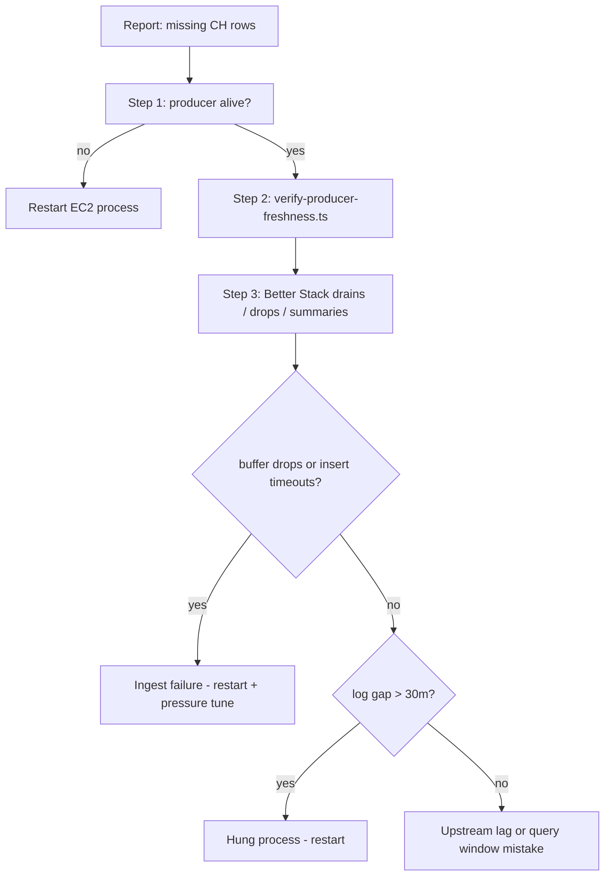

# Better Stack error healing — producer ClickHouse ingest

**Repos:** `tradingflow-cfworker-service` for the active Worker producer; `tradingflow-process-service-ec2` for legacy/process-service checks and ClickHouse scripts
**Sources:** active producer source resolved at runtime; usually `cf-service` when Worker production `UW_ENABLED=true`, otherwise `Process Service[Production]`
**MCP server:** `user-betterstack`  
**Related:** [check-optiontrades-latency/SKILL.md](./check-optiontrades-latency/SKILL.md), `tradingflow-webapp-fullstack/doc/automation/self-healing/error-investigate.md`

---

## Recommended Invocation

Use `/goal` for live or post-incident runs:

- Objective: determine whether the active UW ClickHouse producer is alive, writing fresh ClickHouse rows, and free of drain/drop patterns for the requested trading session.
- Success criteria: active producer owner and Better Stack source/table resolved at runtime, ClickHouse coverage checked with `verify-producer-freshness.ts`, drain/drop/runtime-summary evidence interpreted, and the report names the verdict plus next action.
- Stop condition: producer health is proven, a production-safe remediation path is identified, or access to Better Stack/ClickHouse/EC2 is explicitly blocked.

## Agent Handoff

Last updated: 2026-06-17

### Look First

- [ ] Investigate the 2026-06-17 active-session start gap. `bun scripts/verify-producer-freshness.ts 2026-06-17` at 10:44 EDT showed the producer writing fresh aggregate rows (`max_time=10:44:57` ET, `total_rows=1,066,612`) but still `row_count=0` for 09:30-09:35 ET. Direct raw/aggregate probes showed both tables first had rows at 09:39:12 ET and were fresh through 10:45:16 ET (`AggregatedOptionTrades=1,072,641`, `RawOptionTrades=1,546,612`).
- [ ] Investigate Worker ingest observability after first trade. Better Stack `cf-service` for 13:15-14:50 UTC showed `streaming_started=1`, `channel_join_ack=1`, `streaming_resumed=1`, `uw_ingestion_errors=1` only from pre-open spillover queue metrics timeout at 13:15:01 UTC, and no `write_buffer_drop`, `write_buffer_drop_summary`, `write_buffer_drain_batch`, or timeout logs after open. `uw_websocket_health` still stopped after 13:27:28 UTC despite fresh ClickHouse writes.

### Blocked / Needs Decision

- [ ] Check why `GET https://cfworker-service.engineering-601.workers.dev/uw-ingestion/status` still timed out for 45s on the 10:45 EDT rerun while `/canary` returned `Success`. The status timeout plus missing post-open health reports remain an observability/status-path problem, not proof of writer death, because ClickHouse rows were fresh.

## Runbook Self-Maintenance

At the end of each run:

1. Decide whether producer-health investigation exposed a reusable lesson for this runbook.
2. Promote durable lessons into source resolution, event predicates, interpretation, verification, alerting, or remediation sections.
3. Keep transient state in `Agent Handoff` only, unless it belongs in an incident-specific external record.
4. Prune completed or obsolete handoff items before adding new ones.
5. If no durable rule changed, state `Runbook maintenance: no change` in the final report.

Update this runbook when Better Stack source names, SQL collection shape, event names, thresholds, heartbeat behavior, ClickHouse verification commands, or remediation safety rules drift. Do not update it for one-off row counts, temporary incidents, raw logs, or completed incident progress.

## When to use this runbook

- ClickHouse `AggregatedOptionTrades` / `RawOptionTrades` look empty or thin for part of a session.
- `bun scripts/verify-producer-freshness.ts` returns low `row_count` or odd hourly gaps.
- Customer-visible lag is fine but warehouse row counts drop after the open.

Always pair **Better Stack producer logs** with **ClickHouse time coverage** (see Step 2). Logs explain *why* rows are missing; CH proves *what* is missing.

---

## AI Agent Runbook

### Runtime rules

- Resolve the active UW ClickHouse writer before choosing a Better Stack source. Production Worker `UW_ENABLED=true` means `tradingflow-cfworker-service` owns live UW ingest and the Better Stack source is `cf-service`; legacy process-service ingest uses `Process Service[Production]`.
- Resolve the Better Stack source/table at runtime every session. Do not hardcode stale source IDs.
- Treat `BetterStackHeartbeat` as Better Stack Uptime monitoring, separate from the Logtail source/table used for producer logs.
- Use repo `.env` plus `bun scripts/verify-producer-freshness.ts` for ClickHouse production-cloud checks.
- Do not use ClickHouse MCP against the production cloud service.

### Better Stack source resolution

1. Determine the active writer:
   - Check `tradingflow-cfworker-service/wrangler.jsonc` production `UW_ENABLED`. If `true`, use Better Stack source **cf-service**.
   - If the Worker writer is disabled and process-service `syncUwData` is active, use **Process Service[Production]**.
2. `telemetry_list_sources_tool` → match the active source by name.
3. `telemetry_get_query_instructions_tool` with the runtime `source_id` and `source_type: logs`.
4. Use the returned table names in the SQL below. Current observed source/table pairs:
   - `cf-service` → `t203847.cf_service`, `remote(t203847_cf_service_logs)`, `s3Cluster(primary, t203847_cf_service_s3)`.
   - `Process Service[Production]` → `t203847.process_service`, `remote(t203847_process_service_logs)`, `s3Cluster(primary, t203847_process_service_s3)`.

### Event predicates

| Signal | Predicate |
| --- | --- |
| Elevated buffer | `event = 'write_buffer_elevated'` |
| Buffer drop | message contains `write buffer drop` |
| Insert timeout/exhaustion | message contains `batch insert timeout`, `aggregate batch insert timeout`, `raw batch insert timeout`, or context `errorMessage = 'insert attempts exhausted'` |
| Stale index quote degradation | `event = 'index_refresh_degraded_to_stale_cache'` |
| Requested-family quote outage | `event IN ('index_quote_total_failure', 'index_quote_incomplete')` with requested family uncovered |
| Premarket restart skip | `event = 'first_trade_alert_skipped_premarket'` |
| Runtime summary | `event = 'runtime_summary'` |
| Worker streaming lifecycle | `event IN ('streaming_started', 'streaming_resumed', 'channel_join_sent', 'channel_join_ack')` on `cf-service` |
| Worker health report | `event = 'uw_websocket_health'` on `cf-service`; inspect `interval.*`, `connected`, and `upstreamAllowed` |
| Worker drain/drop | `event IN ('write_buffer_drain_batch', 'write_buffer_drop', 'write_buffer_drop_summary')` or `operation = 'uw_ingestion_error'` on `cf-service` |

### Interpretation matrix

| Evidence | Meaning | Severity |
| --- | --- | --- |
| Worker `streaming_started`/`channel_join_ack` before open, `streaming_resumed` at first trade, CH rows advancing | Active Worker producer is connected and writing | Healthy, unless CH coverage has gaps |
| Worker CH rows advancing but `uw_websocket_health` stops or `/uw-ingestion/status` hangs | Status/observability path problem; do not confuse with write outage without CH staleness | P1 unless CH freshness also fails |
| `write_buffer_elevated`, drains succeeding, no drops | Normal/drain pressure; producer is compensating | Info dashboard |
| `write_buffer_elevated` plus serial `write_buffer_drain_batch` pressure=`warn` | Warn pressure; aggregate/raw inserts serialized by policy | P1/dashboard |
| `index_refresh_degraded_to_stale_cache` | Requested family served from stale Longport/Massive cache | P1/info |
| `index_quote_total_failure` or requested family uncovered | True quote outage for the requested index family | P0 |
| Stuck drain after computed policy budget | Insert attempts exceeded timeout/retry budget | P0 |
| `first_trade_alert_skipped_premarket` | Scheduled premarket restart joined before regular prints; missing-first-trade timer intentionally skipped | Info |

### Post-deploy verification

1. Confirm env/defaults: `UW_WRITE_BUFFER_DRAIN_ENTRY_THRESHOLD=1500`, `UW_MAX_INSERT_ATTEMPTS=3`, `UW_FIRST_TRADE_AFTER_RESTART_ALERT_MS=60000` unless production explicitly overrides them.
2. Run `npm run build`.
3. Run `bun test src/syncUwData/`.
4. Run `node scripts/test-sync-uw-issue-logging.js`.
5. Run `node scripts/test-optionchain-run-issue-logging.js`.
6. After deploy, run `bun scripts/verify-producer-freshness.ts` from repo `.env`.

### Better Stack Uptime heartbeats

- `BetterStackHeartbeat` is registered only in production runtime and sends `GET https://uptime.betterstack.com/api/v1/heartbeat/hBWssf343Zvr6KeQBtW8et64` every 5 minutes. This proves process liveness only.
- `SyncUwClickHouseHeartbeat` is owned by `UnusualWhalesClient` and sends `GET https://uptime.betterstack.com/api/v1/heartbeat/3QB5QMqs8TeZgmoKEb4uYnZV` only when the current session is regular or extended, the real websocket path is open, and a nonzero raw plus aggregate ClickHouse drain succeeded within the last 6 minutes.
- The process monitor should expect a heartbeat every 5 minutes with a grace period large enough to avoid one-off network jitter.
- The ingest monitor must be scheduled or paused for the active market-data window. Otherwise it will false-alert overnight, on weekends, and on market holidays because closed-session missed heartbeats are intentional.
- Local build/test verification must not manually hit the real heartbeat endpoints unless intentionally verifying the live Better Stack monitor, because that starts or advances the monitor heartbeat timeline.
- Do not call `/fail` or `/<exit-code>` for these heartbeats. Missed heartbeats are the failure condition; explicit failure endpoints remain reserved for job-output failure reporting.

---

## MCP setup (each session)

1. Determine the active writer first:
   - Worker production `UW_ENABLED=true` → Better Stack **cf-service**.
   - Process-service `syncUwData` active → Better Stack **Process Service[Production]**.
2. `telemetry_list_sources_tool` → active source name (resolve `source_id` at runtime).
3. `telemetry_get_query_instructions_tool` with that `source_id`, `source_type: logs`.
4. `telemetry_query` with SQL below (replace date bounds and collection names from the instructions).

Hard rule: do **not** reuse stale `source_id` values or stale collection names across months.

---

## Incident pattern: May 19, 2026 (reference)

| Phase | ET | What happened |
| --- | --- | --- |
| Open | 09:30–09:35 | Drains OK; ~221k aggregate rows with `time` in hour 9 |
| Failure | **09:35:41** | ClickHouse insert **timeout** (5s); `aggregate_status=timeout`, `raw_status=timeout` |
| Buffer cap | **09:36** | `write_buffer_depth=10000` (max entries); **3,564** `write buffer drop` logs |
| Silence | **09:36–~14:05** | No `runtime_summary`, no successful drains (~4.5h) |
| Recovery | **~14:05–14:08** | `setup_started` / `websocket_open`; drains resume |
| CH gap | `time` hour **10** | **0 rows** — morning hole in trade-time column |
| Afternoon | 11–16 ET | Millions of rows (late timestamps + normal flow) |

**Root cause (producer-side):** insert timeouts under open load → backlog → write-buffer cap evictions → data never written. Default cap was 10k FIFO (now 50k with premium-priority drain). Not a missing table or CH outage.

**Process death without app error (2026-05-22):** logs stop mid-drain → check EC2 `journalctl` / OOM; ensure `Restart=always` and `registerProcessFatalHandlers`.

**Today check:** May 20+ logs show `drain_failures=0`, healthy `runtime_summary`; use Step 2 daily.

---

## Step 1 — Is the producer alive?

If the Worker is the active writer, query `cf-service` lifecycle and health logs first:

```sql
SELECT
  max(dt) AS last_log_utc,
  countIf(dt > now() - INTERVAL 15 MINUTE) AS logs_last_15m,
  countIf(JSONExtract(raw, 'event', 'Nullable(String)') = 'streaming_started') AS streaming_started,
  countIf(JSONExtract(raw, 'event', 'Nullable(String)') = 'streaming_resumed') AS streaming_resumed,
  countIf(JSONExtract(raw, 'event', 'Nullable(String)') = 'channel_join_ack') AS channel_join_ack,
  countIf(JSONExtract(raw, 'event', 'Nullable(String)') = 'uw_websocket_health') AS health_reports,
  countIf(JSONExtract(raw, 'operation', 'Nullable(String)') = 'uw_ingestion_error') AS ingest_errors
FROM (
  SELECT dt, raw FROM remote(t203847_cf_service_logs) WHERE dt > now() - INTERVAL 2 DAY
  UNION ALL
  SELECT dt, raw FROM s3Cluster(primary, t203847_cf_service_s3)
  WHERE _row_type = 1 AND dt > now() - INTERVAL 2 DAY
)
```

If process-service is the active writer, use the legacy process source:

```sql
SELECT
  max(dt) AS last_log_utc,
  countIf(dt > now() - INTERVAL 15 MINUTE) AS logs_last_15m
FROM (
  SELECT dt FROM remote(t203847_process_service_logs) WHERE dt > now() - INTERVAL 2 DAY
  UNION ALL
  SELECT dt FROM s3Cluster(primary, t203847_process_service_s3)
  WHERE _row_type = 1 AND dt > now() - INTERVAL 2 DAY
)
```

| Signal | Healthy | Investigate |
| --- | --- | --- |
| `logs_last_15m` | > 0 during market hours | Process down or not shipping logs |
| `last_log_utc` | Within minutes of now | Stale logging / crash |

---

## Step 2 — ClickHouse coverage (ground truth)

From repo (`.env` credentials):

```bash
cd tradingflow-process-service-ec2
bun scripts/verify-producer-freshness.ts              # today ET
bun scripts/verify-producer-freshness.ts 2026-05-19   # specific session
```

Script prints:

- Open-window lag (09:30–09:35 ET): p50/p95, `rows_gt_30s`, `row_count`
- **Hourly row counts** by `time` — catches May-19-style **hour 10 = 0** gaps
- `min_time` / `max_time` for the calendar date

| Pattern | Meaning |
| --- | --- |
| `row_count = 0` on a trading day | No rows in open window — ingest failed or never ran |
| Hour 9 only, hour 10 = 0 | Mid-morning gap in `time` (see May 19) |
| `max_time` stops before ~16:00 ET | Ingest stopped mid-session (live incident) |

---

## Step 3 — Drain health (market hours)

Replace date with the trading day under investigation (UTC date for ET open ≈ same calendar day; open 09:30 ET = 13:30 UTC in EDT).

For the Worker active writer, query cf-service drain/drop/error signals:

```sql
SELECT
  countIf(JSONExtract(raw, 'operation', 'Nullable(String)') = 'uw_ingestion_error') AS uw_ingestion_errors,
  countIf(JSONExtract(raw, 'event', 'Nullable(String)') = 'write_buffer_drop') AS write_buffer_drop_events,
  countIf(JSONExtract(raw, 'event', 'Nullable(String)') = 'write_buffer_drop_summary') AS write_buffer_drop_summary_events,
  countIf(JSONExtract(raw, 'event', 'Nullable(String)') = 'write_buffer_drain_batch') AS write_buffer_drain_batch_events,
  countIf(JSONExtract(raw, 'message', 'Nullable(String)') LIKE '%timeout%') AS timeout_message_logs,
  countIf(JSONExtract(raw, 'message', 'Nullable(String)') LIKE '%ch_drain_fail=%') AS health_like_ch_drain_fail_logs
FROM (
  SELECT dt, raw FROM remote(t203847_cf_service_logs)
  WHERE dt >= toDateTime('2026-06-17 13:30:00') AND dt < toDateTime('2026-06-17 21:00:00')
  UNION ALL
  SELECT dt, raw FROM s3Cluster(primary, t203847_cf_service_s3)
  WHERE _row_type = 1 AND dt >= toDateTime('2026-06-17 13:30:00') AND dt < toDateTime('2026-06-17 21:00:00')
)
```

For legacy process-service ingest, use the original drain queries below.

### 3a. Successful drains per minute

```sql
SELECT
  toStartOfMinute(dt) AS minute,
  countIf(JSONExtract(raw, 'message', 'Nullable(String)') LIKE '%drained batch%aggregate_status=success%') AS success_drains,
  countIf(JSONExtract(raw, 'message', 'Nullable(String)') LIKE '%aggregate_status=timeout%') AS timeouts,
  countIf(JSONExtract(raw, 'message', 'Nullable(String)') LIKE '%write buffer drop%') AS buffer_drops
FROM (
  SELECT dt, raw FROM remote(t203847_process_service_logs) WHERE dt > now() - INTERVAL 3 DAY
  UNION ALL
  SELECT dt, raw FROM s3Cluster(primary, t203847_process_service_s3) WHERE _row_type = 1 AND dt > now() - INTERVAL 3 DAY
)
WHERE
  toDate(dt) = '2026-05-19'
  AND dt >= toDateTime('2026-05-19 13:25:00')
  AND dt < toDateTime('2026-05-19 21:00:00')
GROUP BY minute
ORDER BY minute ASC
```

**Alert:** `success_drains = 0` for **> 5 minutes** while `session=regular` (cross-check 3c).

### 3b. Insert failures (sample)

```sql
SELECT
  dt,
  JSONExtract(raw, 'level', 'Nullable(String)') AS level,
  JSONExtract(raw, 'message', 'Nullable(String)') AS message
FROM (
  SELECT dt, raw FROM remote(t203847_process_service_logs) WHERE dt > now() - INTERVAL 3 DAY
  UNION ALL
  SELECT dt, raw FROM s3Cluster(primary, t203847_process_service_s3) WHERE _row_type = 1 AND dt > now() - INTERVAL 3 DAY
)
WHERE
  toDate(dt) = '2026-05-19'
  AND (
    JSONExtract(raw, 'message', 'Nullable(String)') LIKE '%aggregate batch insert timeout%'
    OR JSONExtract(raw, 'message', 'Nullable(String)') LIKE '%write buffer drop%'
    OR JSONExtract(raw, 'event', 'Nullable(String)') = 'write_buffer_elevated'
  )
ORDER BY dt ASC
LIMIT 100
```

### 3c. `runtime_summary` gaps

```sql
SELECT
  toStartOfHour(dt) AS hour_utc,
  countIf(JSONExtract(raw, 'event', 'Nullable(String)') = 'runtime_summary') AS summaries,
  countIf(JSONExtract(raw, 'message', 'Nullable(String)') LIKE '%drained batch%') AS drain_logs
FROM (
  SELECT dt, raw FROM remote(t203847_process_service_logs) WHERE dt > now() - INTERVAL 3 DAY
  UNION ALL
  SELECT dt, raw FROM s3Cluster(primary, t203847_process_service_s3) WHERE _row_type = 1 AND dt > now() - INTERVAL 3 DAY
)
WHERE toDate(dt) = '2026-05-19'
GROUP BY hour_utc
ORDER BY hour_utc ASC
```

**May 19:** summaries/drains only in hours **13** and **18–20** UTC; gap **14–17** UTC matches CH morning hole.

### 3d. Last `runtime_summary`

```sql
SELECT
  dt,
  JSONExtract(raw, 'message', 'Nullable(String)') AS message
FROM (
  SELECT dt, raw FROM remote(t203847_process_service_logs) WHERE dt > now() - INTERVAL 1 DAY
  UNION ALL
  SELECT dt, raw FROM s3Cluster(primary, t203847_process_service_s3) WHERE _row_type = 1 AND dt > now() - INTERVAL 1 DAY
)
WHERE JSONExtract(raw, 'event', 'Nullable(String)') = 'runtime_summary'
ORDER BY dt DESC
LIMIT 5
```

Parse: `drain_failures`, `drain_timeouts`, `dropped_aggregate_rows`, `write_buffer_drops`, `max_write_buffer_depth`, `aggregate_rows_written`.

---

## Step 4 — Decision matrix

| Evidence | Verdict | Action |
| --- | --- | --- |
| CH hourly gap + `write buffer drop` spike + insert timeouts | **Producer ingest failure** | Restart process service; tune pressure settings (see code); watch CH `max(time)` recover |
| CH gap, logs silent >30m, no errors | **Process hung / crashed** | SSH EC2; restart; inspect OOM/systemd |
| `aggregate batch insert timeout` only, few drops | **ClickHouse slow** | CH Cloud load; confirm `SyncUwWriteDrainPolicy` is applying drain/warn pressure |
| `index_refresh_degraded_to_stale_cache` only | **Quote degradation covered** | Monitor; not a P0 while requested family is served |
| `index_quote_total_failure` or requested family uncovered | **True index quote outage** | Treat as P0 for affected index family |
| `first_trade_alert_skipped_premarket` | **Expected premarket restart behavior** | No missing-first-trade incident unless regular-session summaries are silent |
| No CH rows weekend | **Expected** | None |
| CH OK, high `late_gt30s_upstream` only | **Upstream UW** | Not a CH-missing-rows incident |

---

## Alerting recommendations (Better Stack)

Create charts/alerts on the active producer logs: **cf-service** when Worker ingest is active, or **Process Service[Production]** for legacy process-service ingest.

| Alert | Condition | Severity |
| --- | --- | --- |
| Write buffer drops | `message` contains `write buffer drop` > **50/min** | P0 |
| Write buffer pressure + timeout | `aggregate batch insert timeout` (or `aggregate_status=timeout`) **and** `write_buffer_depth` > **5000** in same minute | P0 |
| CH trade time stale | `max(time)` in `AggregatedOptionTrades` not advancing **> 10 min** during US regular session (verify via `verify-producer-freshness.ts`) | P0 |
| Aggregate/raw insert exhaustion | insert timeout/exhaustion after retry budget | P0 |
| Drain stall | No `event = runtime_summary` for **> 3 min** during 13:00–21:00 UTC weekdays | P0 |
| Low-priority lag at open | `max_low_priority_lag_ms` in `runtime_summary` p95 > **120s** in first 5 min after 13:30 UTC | P1 |
| Requested-family quote unavailable | `event IN ('index_quote_total_failure', 'index_quote_incomplete')` where requested family is uncovered | P0 |
| Elevated buffer | `event = write_buffer_elevated` any occurrence at open | P1/info dashboard |
| Stale quote degradation | `event = index_refresh_degraded_to_stale_cache` | P1/info dashboard |
| Longport partial omission | `event = index_quote_incomplete` with fallback coverage | P1/info dashboard |
| Premarket first-trade skip | `event = first_trade_alert_skipped_premarket` | Info |
| High late-trade drops | `high late-trade drop rate` (existing) | P1 (context) |

Wire notifications to the same channel as existing `[WebSocketService]` P0 errors.

---

## Code mitigations (2026-05-20 follow-up)

| Change | File | Behavior |
| --- | --- | --- |
| Sync UW write-drain policy | `src/syncUwData/write-drain-policy.ts` | Default drain threshold **1,500** entries; drain pressure uses 1,000-entry batches, 10s timeout, 500ms retry; warn pressure uses 500-entry batches, serialized aggregate→raw inserts, 15s timeout, 1s retry |
| Retry and alert env | `src/syncUwData/write-drain-policy.ts` | `UW_MAX_INSERT_ATTEMPTS` default **3**; stuck alert budget includes attempts, retry delays, and serial sink mode |
| First-trade alert env | `src/syncUwData/write-drain-policy.ts` | `UW_FIRST_TRADE_AFTER_RESTART_ALERT_MS` default **60s**; scheduled premarket restarts emit `first_trade_alert_skipped_premarket` instead of scheduling the error timer |
| Index quote outcomes | `src/syncUwData/index-quote-provider.ts` | Fresh and stale-covered requested families keep serving; P0 only when the requested family has no fresh/stale quote |
| Coverage script | `scripts/verify-producer-freshness.ts` | Hourly CH distribution + open-window lag |

| Priority write buffer | `src/syncUwData/write-buffer-priority.ts` | Dual queue (high/low); high = any fill `premium ≥ UW_PREMIUM_HIGH_PRIORITY_THRESHOLD` (default **25k**); cap `UW_WRITE_BUFFER_MAX_ENTRIES` (default **50k**); low drain gated by `UW_LOW_DRAIN_GATE_HIGH_DEPTH` (default **1500**) |
| ClickHouse client transport | `src/shared-clients/clickhouse/client.ts` | Request/response compression, keep-alive, `max_open_connections=20` (global; no async_insert on shared client) |
| SyncUw async insert | `src/syncUwData/sql.ts` | Per-insert `async_insert=1`, `wait_for_async_insert=0` on raw/agg option-trade inserts only; ordering by trade time not required |
| Latency-aware drain pressure | `src/syncUwData/write-drain-policy.ts` | Normal tier: **800** batch cap, **10s** insert timeout; escalate to drain/warn when buffer depth **or** insert p99 ≥ **3s** / **8s** |
| Process fatal logging | `src/utils/process-fatal-handlers.ts` | `uncaughtException` / `unhandledRejection` → Better Stack before exit |

Constants/env reference: `UW_WRITE_BUFFER_MAX_ENTRIES` (default **50_000**), `UW_WRITE_BUFFER_MAX_RAW_ROWS` (default **100_000**), `UW_PREMIUM_HIGH_PRIORITY_THRESHOLD` (default **25_000**), `UW_LOW_DRAIN_GATE_HIGH_DEPTH` (default **1500**), `UW_WRITE_BUFFER_DRAIN_ENTRY_THRESHOLD=1500`, `UW_MAX_INSERT_ATTEMPTS=3`, `UW_FIRST_TRADE_AFTER_RESTART_ALERT_MS=60000`, `INDEX_TIMEOUT_MS` default fallback **6000ms**.

**Friday 2026-05-22 outage ops:** [friday-2026-05-22-streaming-outage.md](../ops/friday-2026-05-22-streaming-outage.md) — EC2 forensics, restart, backfill decision.

---

## Ops checklist (live incident)

0. **Pre-deploy / post-incident env (EC2 process-service):** Confirm `UW_WRITE_BUFFER_MAX_ENTRIES=50000` (not legacy `10000` — May-22 timeouts showed `write_buffer_depth=9999`). Also `UW_WRITE_BUFFER_DRAIN_ENTRY_THRESHOLD=1500`, `UW_MAX_INSERT_ATTEMPTS=3`. Code defaults apply when unset; explicit env on the unit avoids drift.

1. Run Step 1–2 (MCP + `verify-producer-freshness.ts`).
2. If `max(time)` is stale during market hours → restart producer on EC2.
3. After restart, confirm within 5 min:
   - `drained batch ... aggregate_status=success` in logs
   - CH `max(time)` advancing
4. Post-mortem: count `write buffer drop` + `aggregate batch insert timeout` in the failure window.
5. Optional: compare `RawOptionTrades` vs `AggregatedOptionTrades` `max(time)` — both should move together.

---

## Agent workflow


